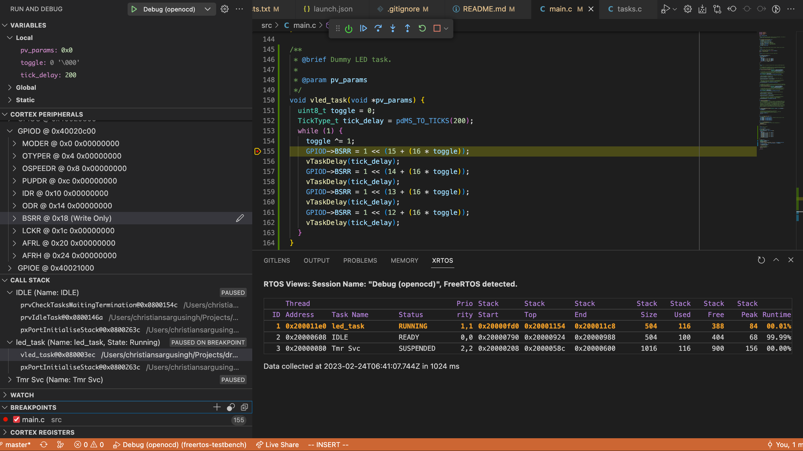

# FreeRTOS Test Bench
[](https://github.com/dronectl/freertos-testbench/actions/workflows/ci.yaml)

Modified: 2023-02

This repository serves as an open source test bench for developing applications using the [FreeRTOS-Kernel](https://github.com/FreeRTOS/FreeRTOS-Kernel.git) on the STM32F411VET6U MCU as part of the STM32F411E-DISCO Evaluation Board. Many of the integrations in this repository can be ported to different MCUs.

## Navigation
1. [Features](#features)
1. [Software Requirements](#software-requirements)
2. [Quickstart](#quickstart)
3. [VSCode Configuration](#vscode-configuration)
4. [License](#license)

## Features
### VSCode Integration
 - XRTOS Task View
 - MCU Memory View
 - Hardware Peripheral Map
 - GDB Debugging Utilities
 - Intellisense configured with compile commands generated by CMake project
### Custom CMake specification
 - FreeRTOS-Kernel and STM32F4 source fetched as part of project build.
 - Automatic toolchain discovery and configuration.

## Software Requirements
This toolchain leverages the following software tools:
 - [CMake](https://cmake.org) (Build system)
 - [ARM GCC](https://developer.arm.com/Tools%20and%20Software/GNU%20Toolchain) (Code generation toolchain)
 - [OpenOCD](https://openocd.org) (Open source on-chip debugger)

See the [installation guide](docs/README.md) for installation instructions.

## Quickstart
Clone this project:
```bash
git clone git@github.com:dronectl/freertos-testbench.git
cd freertos-testbench
```

Build the project. For debug symbols and FreeRTOS task statistics build for debug mode:
> If no build type is specified the project will default to a release build.

```bash
mkdir build
cd build
cmake .. -DCMAKE_BUILD_TYPE=DEBUG
...
```

Compile the project
```bash
make -j`nproc`
```

Flash the board:
> OpenOCD automatically detects an STLINK device over USB.
```bash
make flash
```

## VSCode Configuration
In order to setup VSCode for this project, it is recommended you install the following extensions:
1. `ms-vscode.cpptools`
2. `marus25.cortex-debug`
3. `twxs.cmake`

Copy the [`dev/.vscode`](/dev/.vscode) directory to the repository root. The files included provide the following capability:
1. `c_cpp_properties.json` -> configuration for intellisense and static analysis tools.
2. `launch.json` -> configuration for vscode debugging interface.

### Intellisense
Because the `c_cpp_properties.json` requires the compile commands file generated by cmake to operate, you will need to build the project (see [Quickstart](#quickstart)). Intellisense will look for a `compile_commands.json` file in the `build` directory. 

If you make a change to the source files simply rebuild the project. The compile commands will be updated by CMake and VSCode will detect and apply these changes automatically.

### Debugger Launch
> Note you must build the project with `-DCMAKE_BUILD_TYPE=DEBUG` to enable debug symbols.

Once the project binary is built using `make`, we can launch the vscode debugger using the `F5` key. Here is a sample view of the debugging utilities:



Below is a list of capabilities provided by the `cortex-debug` extension:
 - Cortex peripheral register read and set
 - Variable inspection and watchpoints
 - Live breakpoints
 - Task seperated call stacks
 - Task runtime statistics
 - MCU memory inspection


## License
This project is licensed for use under the terms of the [LGPL-3.0 license](LICENSE).